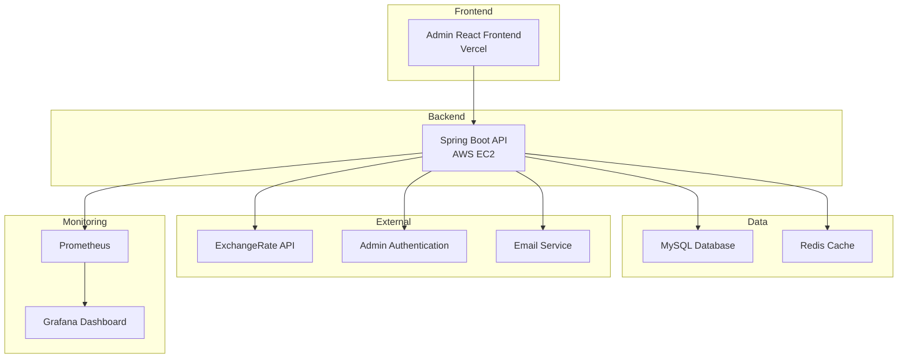

# 🏛️ Exchange Rate & Remittance Admin System

> 환율 조회와 해외 송금 서비스를 가상으로 구축한 **관리자 시스템** 웹 애플리케이션

---

### Backend
 

 
 
 
 

### DevOps & Monitoring

 
 

### Frontend
 
 
 

---

## 📸 프로젝트 소개

환율 API 기반 환율 조회와 해외 송금 서비스를 가상으로 제공하는 웹 애플리케이션의 **관리자 시스템**입니다.

**🔧 주요 기능:**
- 관리자 대시보드 (송금/환율/사용자 통계)
- 송금 관리 (내역 조회, 한도 관리, 서류 미리보기)
- 계정 관리 (사용자/관리자 관리)
- 국가/은행 관리, 공지사항 관리, Q&A 관리

**⚙️ 주요 기술:**
- Redis 캐싱, Docker 컨테이너화
- Prometheus/Grafana 모니터링 및 알림

> **주요 화면 보기**: [Wiki에서 확인](https://github.com/dongjang/exchange_rate_admin/wiki/%EC%A3%BC%EC%9A%94-%ED%99%94%EB%A9%B4)

---

## 🌟 핵심 기능

- **📊 관리자 대시보드** - 송금/환율/사용자 통계, 한도 변경 신청, Q&A 미답변, 인기 공지사항
- **💸 송금 관리** - 송금 내역, 송금 한도 관리, 서류 미리보기 (서류 검토, 승인/반려, 자동 이메일)
- **👥 계정 관리** - 사용자 관리, 관리자 관리, 계정 상태 관리
- **🌍 국가/은행 관리** - 송금 가능 국가/은행/통화 목록 관리
- **📢 공지사항 관리** - 공지사항 작성, 수정, 삭제, 우선순위 설정, 만료된 긴급 공지사항 상태 자동 변경 처리
- **❓ Q&A 관리** - 고객 문의사항 답변, FAQ 관리, 자동 이메일 발송
- **📊 모니터링** - Prometheus/Grafana 기반 관리자 시스템 모니터링 및 알림

## 🛠️ 기술 스택

### Backend
| 기술 | 버전 | 설명 |
|------|------|------|
| **Java** | 17 | 프로그래밍 언어 |
| **Spring Boot** | 3.2.6 | 웹 프레임워크 |
| **Spring Security** | - | 인증/인가 |
| **Spring Data JPA** | - | 데이터 액세스 |
| **MyBatis** | 3.0.3 | SQL 매퍼 |
| **MySQL** | 8.0 | 데이터베이스 |
| **Redis** | 7 | 캐시 서버 |

### DevOps & Monitoring
| 기술 | 설명 |
|------|------|
| **Docker** | 컨테이너화 |
| **GitHub Actions** | CI/CD 파이프라인 |
| **AWS EC2** | 클라우드 호스팅 |
| **Prometheus** | 메트릭 수집 |
| **Grafana** | 모니터링 대시보드 |

### Frontend
| 기술 | 버전 | 설명 |
|------|------|------|
| **React** | 18 | UI 라이브러리 |
| **TypeScript** | 5.8 | 타입 안전성 |
| **Vite** | 7.0 | 빌드 도구 |
| **Jotai** | 2.12 | 상태 관리 |
| **React Router** | 6.30 | 라우팅 |

---

## 🏗️ 시스템 아키텍처

## 🛠️ 개발 과정에서의 도전과 해결

### 🤖 AI 활용 개발 효율화
- **문제**: 전체 비즈니스 로직 AI 구현 요청 → 결과 미흡, 시간 소모
- **해결**: AI로 초기 틀 구축 후 세부 로직/쿼리 직접 작성
- **결과**: 개발 효율 향상, 시간 절약

### 👥 사용자/관리자 기능 분리
- **문제**: 동일 세션에서 로그인/로그아웃 충돌, 권한 관리 복잡
- **해결**: 사용자/관리자 영역 분리, 인증 로직 명확화
- **결과**: 유지보수 용이, 안정성 및 보안성 향상

### 📧 자동 이메일 알림 시스템
- **문제**: 송금 한도 변경 승인/반려 처리, Q&A 답변 시 사용자 알림 필요
- **해결**: Spring Mail + Gmail SMTP를 활용한 HTML 템플릿 기반 이메일 시스템 구현
- **결과**: 자동화된 고객 커뮤니케이션 및 알림 시스템

### 🐳 서버 실행 환경 개선
- **문제**: EC2에서 jar 실행 시 환경 변수 수동 설정 필요
- **해결**: Docker Compose 도입 → 한 번의 명령으로 전체 실행
- **결과**: 서버 실행 간편화, 개발 효율 향상

### 📁 파일 관리 시스템 구현
- **문제**: 한글 파일명 처리, 다양한 파일 타입 지원, Base64 변환, 파일 경로 관리
- **해결**: UUID 기반 파일명 생성, Content-Type 자동 감지, 다중 경로 파일 검색, 한글 파일명 URL 인코딩
- **결과**: 안정적인 파일 업로드/다운로드 시스템 구축

## 🌐 체험하기

> ⚠️ **로그인 시 502 Bad Gateway 에러 발생 시**: EC2 서버가 중지 상태입니다. 개인 프로젝트 특성상 비용 절약을 위해 필요시에만 서버를 가동합니다.

**🔗 관리자 시스템**: [https://exchange-rate-admin.vercel.app/](https://exchange-rate-admin.vercel.app/)

> 💡 **관리자 계정은 보안상 따로 공개하지 않습니다. 체험을 원하시면 아래 정보로 연락 부탁드립니다.**
> 
> 📧 **문의**: [jdwls27@gmail.com](mailto:jdwls27@gmail.com)

**🔗 사용자 서비스**: [https://exchange-rate-theta-blue.vercel.app/](https://exchange-rate-theta-blue.vercel.app/)

> 💡 Google 계정으로 로그인 후 환율 조회 및 송금 시뮬레이션을 체험해보세요!

## 📁 프로젝트 저장소
- **관리자 프로젝트**: 현재 저장소
- **사용자 프로젝트**: [https://github.com/dongjang/exchange_rate](https://github.com/dongjang/exchange_rate)

## 📋 배포 환경
- **관리자 프론트엔드**: Vercel (React SPA 배포) - 관리자 UI 구현
- **사용자 프론트엔드**: Vercel (React SPA 배포) - 사용자 UI 구현  
- **백엔드**: AWS EC2 + Docker (컨테이너화된 Spring Boot) - 관리자/사용자 공통 API 서버